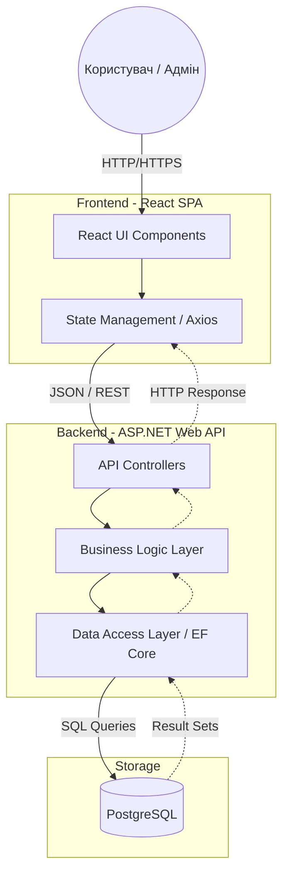
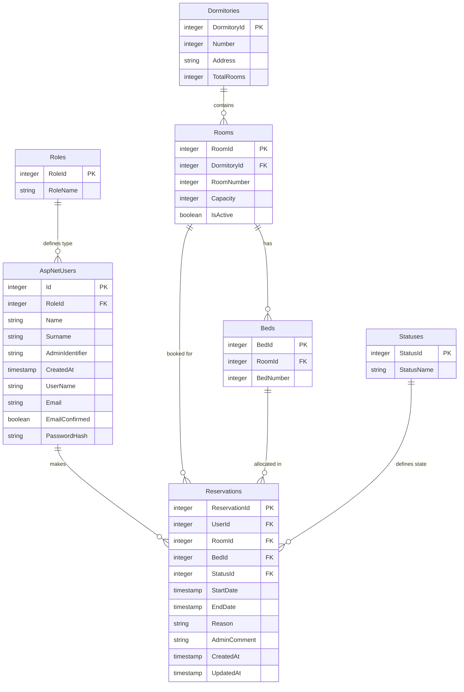

# Система бронювання гостьових кімнат гуртожитку

## 1. Огляд системи

Даний проект є веб-платформою, призначеною для автоматизації процесу поселення та управління гостьовими кімнатами в мережі гуртожитків. Система замінює паперовий облік та хаотичне листування єдиним цифровим простором для адміністраторів та гостей.

### 🎯 Призначення

Основна мета системи — забезпечити прозорий процес вибору доступних кімнат, онлайн-бронювання та контроль завантаженості кімнат.

### 👥 Рольова модель

Гість (Користувач): Перегляд доступних кімнат на конкретні дати, створення заявок на бронювання, перегляд статусу своїх заявок.

Адміністратор: Управління реєстром кімнат, підтвердження або відхилення заявок, моніторинг поточної зайнятості.

| Компонент | Технологія           | Роль                                                                        |
| --------- | -------------------- | --------------------------------------------------------------------------- |
| Frontend  | React (JavaScript)   | Побудова інтерактивного інтерфейсу та управління станом на стороні клієнта. |
| Backend   | ASP.NET Web API (C#) | Обробка бізнес-логіки, безпека, інтеграція з базою даних через EF Core.     |
| Database  | PostgreSQL           | Надійне зберігання реляційних даних.                                        |
| API Docs  | Swagger              | Автоматична документація та тестування ендпоінтів.                          |

### 🚀 Ключові функції

Пошук та Фільтрація: Пошук вільних місць за датами, кількістю ліжок та зручностями.

Динамічні статуси: Система автоматично блокує дати після підтвердження бронювання.

Особистий кабінет: Історія бронювань для користувачів та панель управління для персоналу.

Валідація: Перевірка на "накладання" дат (double-booking) на рівні бізнес-логіки.

## 2. Архітектура системи (System Architecture)

В даній системі використовується клієнт-серверна архітектура. Це забезпечує чіткий поділ відповідальності між інтерфейсом користувача, бізнес-логікою та рівнем збереження даних.

Нижче наведено схему того, як дані проходять від користувача до бази даних через основні вузли системи:



## 3. Опис бази даних

Для зберігання даних використовується реляційна СУБД PostgreSQL. Взаємодія з базою здійснюється через Entity Framework Core за підходом Code First.



## 4. Документація API

Взаємодія між React-клієнтом та ASP.NET сервером відбувається через REST API. Для тестування та перегляду документації в реальному часі інтегровано Swagger UI.

### 📍 Основні Ендпоінти

🔐 Автентифікація (Auth)

| Метод | Ендпоінт           | Опис                                      |
| ----- | ------------------ | ----------------------------------------- |
| POST  | /api/auth/login    | Авторизація користувача та отримання JWT. |
| POST  | /api/auth/register | Реєстрація нового акаунта в системі.      |

📅 Бронювання (Reservation)

| Метод | Ендпоінт                            | Опис                                                       |
| ----- | ----------------------------------- | ---------------------------------------------------------- |
| GET   | /api/reservations                   | Отримання списку всіх бронювань (з підтримкою фільтрації). |
| GET   | /api/reservations/{reservation_id}  | Детальна інформація про конкретне бронювання.              |
| GET   | /api/reservations/available-options | Пошук доступних варіантів за датою.                        |
| POST  | /api/reservations                   | Створення нового запиту на бронювання.                     |
| PUT   | /api/reservations/{reservation_id}  | Оновлення даних бронювання (наприклад, зміна статусу).     |

## 5. Інструкція з розгортання

Дотримуйтесь цієї інструкції для локального запуску системи на вашій машині. Проект розділений на два окремі репозиторії.

### 📋 Попередні вимоги (Prerequisites)

|          |                                                                |
| -------- | -------------------------------------------------------------- |
| Backend  | .NET 8.0 SDK                                                   |
| Frontend | Node.js (рекомендовано v20+) та менеджер пакетів npm або yarn. |
| Database | PostgreSQL (v14+)                                              |
| Tools    | Git                                                            |
| IDE      | Visual Studio, VS Code або Rider                               |

### 📥 Отримання вихідного коду

Система розділена на два окремі репозиторії. Склонуйте їх у робочу директорію:

```
# Клонування бекенду
git clone https://github.com/SofiaRekhman/AccommodationSystemBackend.git

# Клонування фронтенду
git clone https://github.com/bohdanahorbachuk/accommodation_system.git
```

### ⚙️ Налаштування Бекенду (ASP.NET Web API)

Конфігурація БД: У файлі appsettings.json оновіть рядок підключення ConnectionStrings, вказавши ваші дані для PostgreSQL.

Встановлення залежностей:

```
dotnet restore
```

Міграції та база даних: Щоб створити структуру таблиць та заповнити її початковими даними (Seed data):

```
# Створення міграції (якщо є зміни в моделях)
dotnet ef migrations add InitialCreate

# Оновлення бази даних
dotnet ef database update
```

Запуск:

```
dotnet run
```

Сервер зазвичай доступний за адресою https://localhost:7193.

### 💻 Налаштування Фронтенду (React)

Встановлення модулів: Перейдіть у папку проекту та виконайте:

```
npm install
```

Запуск:

```
npm run dev
```

Додаток відкриється за адресою http://localhost:5173.

### ⚠️ Важливі застереження

Порядок запуску: Завжди запускайте Backend першим. Frontend-додаток при завантаженні робить запити до API (наприклад, для отримання доступних опцій), і якщо сервер вимкнений, ви побачите помилки з'єднання або порожній інтерфейс.

CORS: Переконайтеся, що в Program.cs бекенду дозволено запити з адреси фронтенду (http://localhost:5173), інакше браузер блокуватиме запити.
